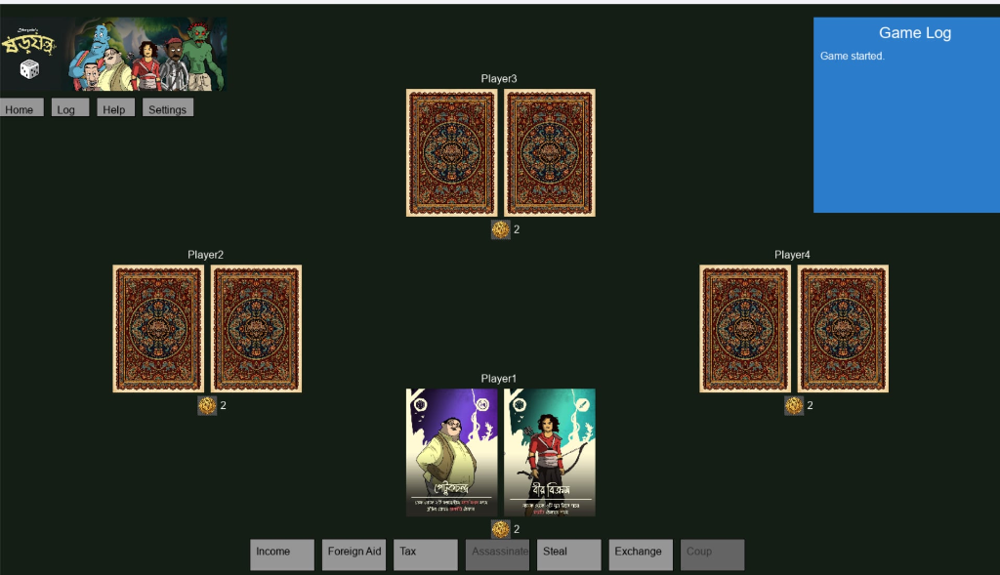

# Shorojontro

A digital multiplayer card game of deception and strategy.

This project was developed for the **CSE 4202 Structured Programming ii** course.

## Gameplay
Players start with two influence cards and a few coins. The goal is to eliminate all other players' influence and be the last one standing. You can claim to have any role to take actions, but if you're challenged and caught bluffing, you lose an influence!



## How to Run
1. Make sure you have Windows with MSYS2 and MinGW installed.
2. Ensure SDL2, SDL2_image, and SDL2_ttf are installed in your MSYS2 environment.
3. Double-click the `play.bat` file to run the game directly if it's already compiled.
4. If you need to compile the game from source, open a terminal in MSYS2 and use the following command:
   ```bash
   gcc -o shorojontro.exe sdl_main.c game.c -lmingw32 -lSDL2main -lSDL2 -lSDL2_image -lSDL2_ttf
   ```

## Logo


## Manual

